# 🌸 Mainichi Notebook (毎日ノート)
### All-in-One Japanese Study Hub & Digital Notebook for iPadOS & iOS

[](https://swift.org)
[](https://developer.apple.com)
[](https://developer.apple.com)
[](#-technical-architecture--engineering-highlights)
[-brightgreen.svg?style=flat-square)](#)
[](LICENSE)

<p align="center">
  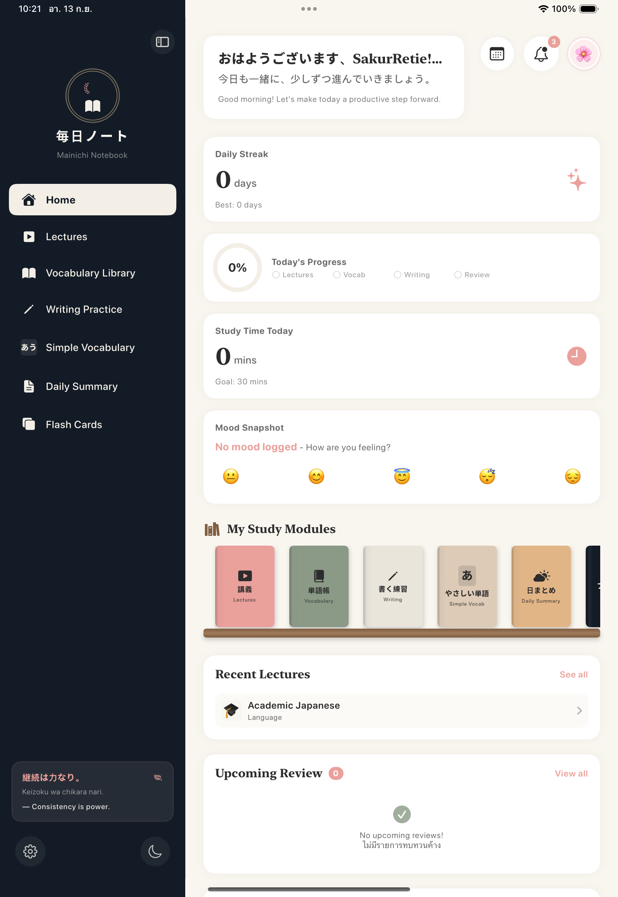
</p>


<details>
<summary><b>🌸 The Story Behind Mainichi Notebook (Click to expand)</b></summary>
<br/>
Mainichi Notebook was built as an anniversary gift for my partner, who has been studying Japanese.
Watching their daily study routine, I noticed how inconvenient it was to constantly juggle multiple apps—one for taking lecture notes, another for flashcards, and others for kana handwriting and audio pronunciation. I wanted to make things easier, so I built an all-in-one native iPad app tailored specifically for Japanese learning, bringing digital handwriting, spaced repetition flashcards, and stroke-order practice together in one place.
---
</details>
---

## 📑 Table of Contents
1. [Overview](#-overview)
2. [Key Features & Visual Tour](#-key-features--visual-tour)
   - [Lectures & Digital Notebook (Apple Pencil Canvas)](#1--lectures--digital-notebook-apple-pencil-canvas)
   - [Paper Template Library & Custom Imports](#2--paper-template-library--custom-imports)
   - [Interactive Annotations, Stickers & PDF Annotation](#3--interactive-annotations-stickers--pdf-annotation)
   - [Home Dashboard & Daily Study Planner](#4--home-dashboard--daily-study-planner)
   - [Vocabulary Library & Custom Word Creator](#5--vocabulary-library--custom-word-creator)
   - [Kana & Kanji Handwriting Practice](#6--kana--kanji-handwriting-practice)
   - [Thematic Simple Vocabulary Packs](#7--thematic-simple-vocabulary-packs)
   - [Daily Summary & Study Journal](#8--daily-summary--study-journal)
   - [Spaced Repetition System (SRS) & Flashcards](#9--spaced-repetition-system-srs--flashcards)
   - [Settings, Customization & Dual Themes](#10--settings-customization--dual-themes)
3. [Technical Architecture & Engineering Highlights](#-technical-architecture--engineering-highlights)
4. [Project Structure](#-project-structure)
5. [Prerequisites & Getting Started](#-prerequisites--getting-started)
6. [Security & Privacy](#-security--privacy)
7. [License](#-license)

---

## 📖 Overview

**Mainichi Notebook (毎日ノート)** is a specialized, native iPadOS and iOS productivity application engineered specifically for Japanese language learners. It seamlessly merges the tactile retention benefits of digital handwriting via **Apple Pencil & PencilKit** with the cognitive efficiency of algorithmic **Spaced Repetition System (SRS)** flashcard review.

Instead of fragmenting the study workflow across separate flashcard apps, PDF readers, and generic note-taking tools, **Mainichi Notebook** unifies them into a cohesive Japanese study environment. Designed around a warm wabi-sabi paper aesthetic, it provides dedicated vector study sheets (such as *Genkouyoushi* manuscript paper and *Cornell Notes*), real-time stroke order kana tracing, audio pronunciation, and multi-mode vocabulary testing.

### Core Principles
- **Tactile Learning First**: Fine-tuned PencilKit canvas with sub-millisecond stroke response and simultaneous pinch-to-zoom multi-touch handling.
- **Cognitive Retention**: Proprietary SuperMemo-2 (SM-2) Spaced Repetition scheduling engine with dynamic intervals and ease factor recalculation.
- **100% Offline & Private**: Zero external network calls, zero telemetry, and zero third-party dependencies. All user notebooks, audio files, and progress data are stored securely on the local device filesystem.
- **Pure Native Swift & SwiftUI**: Crafted using modern Swift 6 concurrency, UIKit interoperability, and Apple native design guidelines.

---

## ✨ Key Features & Visual Tour

### 1. 📝 Lectures & Digital Notebook (Apple Pencil Canvas)
The heart of Mainichi Notebook is an interactive digital notebook workstation engineered for handwritten lecture notes, exercises, and linguistic diagrams.

* **Wooden Bookshelf Display**: Notebooks are organized on a wooden bookshelf interface with customizable color covers, Japanese and English titles, subject badges (*Language, Culture, Science, Humanities*), and page counters.
* **Low-Latency PencilKit Engine**: Supports smooth calligraphy and standard writing tools including Study Pen, Fountain Pen, Calligraphy Brush, Pencil, Highlighter, and Vector Eraser.
* **Concurrent Gesture Workspace**: Integrated via a custom UIKit `CenteringUIScrollView` and `UIGestureRecognizerDelegate`, enabling smooth multi-touch pinch-to-zoom and canvas panning without stroke interruptions or tool contention.
* **Page Management & Thumbnail Drawer**: Reorder, add, or delete pages on the fly with a collapsible left thumbnail navigation drawer.

<p align="center">
  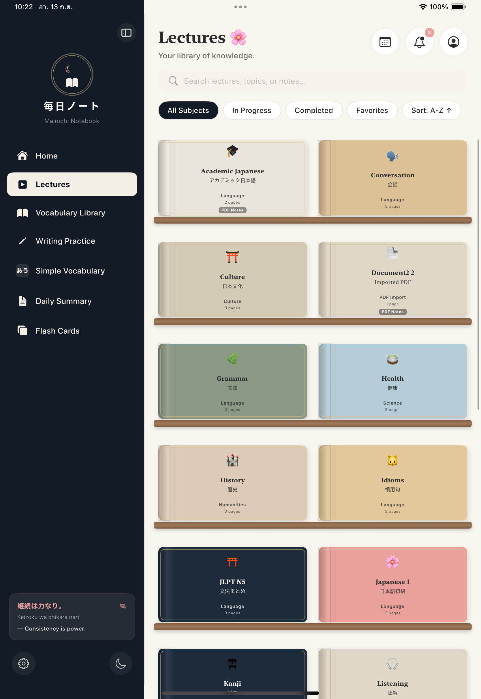
  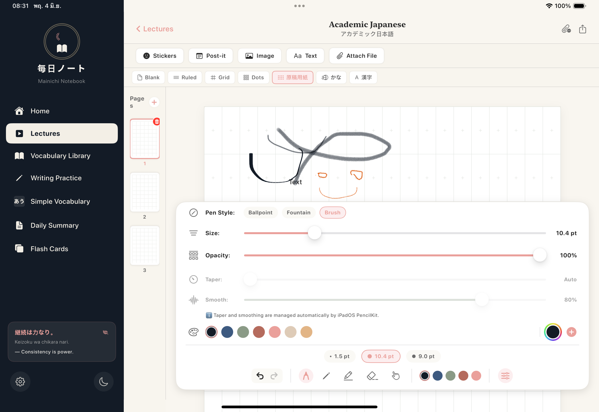
</p>

---

### 2. 📑 Paper Template Library & Custom Imports
Take notes on specialized Japanese study paper instead of blank screens.

* **8 Built-in Vector Study Templates**:
  * **Genkouyoushi (原稿用紙)**: Traditional Japanese manuscript paper with centered grid crosses for kanji composition.
  * **Cornell Notes**: Dedicated cue columns, note-taking canvas, and bottom summary blocks.
  * **Kana & Kanji Grids**: 4-quadrant character practice blocks with stroke alignment guides.
  * **Grammar Patterns**: Pre-formatted syntax connection and conjugation tables.
  * **Standard Paper**: Ruled, Classic Grid, Dot Grid, and Clean Blank paper.
* **Template Selector**: Bookmark favorite paper types, apply templates to the current page, or create new pages pre-loaded with specific templates.
* **Custom Paper & Document Importer**: Import your own custom paper backgrounds or high-resolution graphic grids directly from device storage.

<p align="center">
  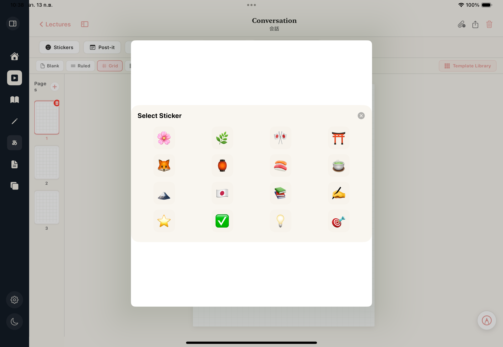
</p>

---

### 3. 🎨 Interactive Annotations, Stickers & PDF Annotation
Enrich your study notes with interactive digital elements.

* **Japanese Cultural Stickers**: Decorate notebooks with themed sticker stamps (🌸 Sakura, ⛩️ Torii Gate, 🗻 Mount Fuji, 🏮 Chōchin Lantern, 🦊 Kitsune, 🍵 Matcha, 🍣 Sushi, and study achievement marks).
* **Movable Post-it Sticky Notes**: Add typed notes and reminders that can be resized, dragged, and positioned anywhere on the canvas.
* **Photo Library Integration**: Insert reference diagrams, textbook pictures, and grammar infographics directly onto notebook pages.
* **PDF Handout Annotation**: Import multi-page lecture slides and PDF documents to write, highlight, and take notes directly on top of slides.
* **High-Res Page Flattening**: Render and export pages combining background templates, Apple Pencil handwriting, and multimedia annotations into crisp, high-resolution images via the native iOS Share Sheet.

<p align="center">
  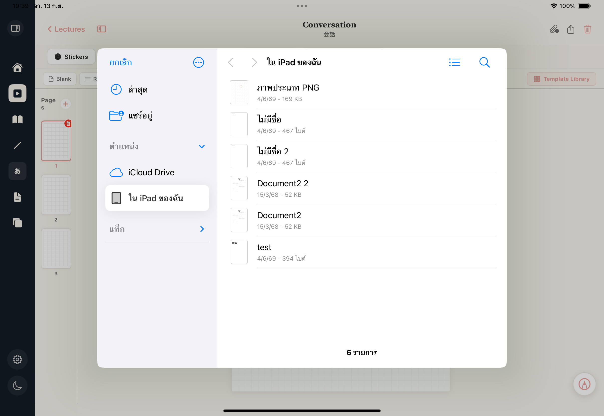
</p>

---

### 4. 🏠 Home Dashboard & Daily Study Planner
A centralized command center designed to keep learners focused, motivated, and consistent.

* **Bilingual Japanese Greeting**: Time-aware greeting widget with English translation (e.g., `おはようございます、SakurRetie! 🌸`).
* **Daily Streak Tracker**: Automatically calculates consecutive active study days and preserves your all-time best streak.
* **Progress Ring (4 Core Metrics)**: Circular visual progress indicator tracking daily completion across Lectures, Vocabulary, Handwriting, and SRS Reviews.
* **Study Time Goal**: Configurable daily target timer (e.g., 30 minutes) measuring total logged study time.
* **Mood Logger**: 5-point emotional status logger (Happy, Blessed, Neutral, Sleepy, Sad) to correlate mood with retention.
* **Today\'s Plan (Interactive Checklist)**: Customizable checklist with estimated task durations and total calculated study minutes.
* **Japanese Proverb of the Day**: Curated wisdom widget featuring kanji, furigana readings, and English translations (e.g., `継続は力なり - Consistency is power`).

<p align="center">
  
  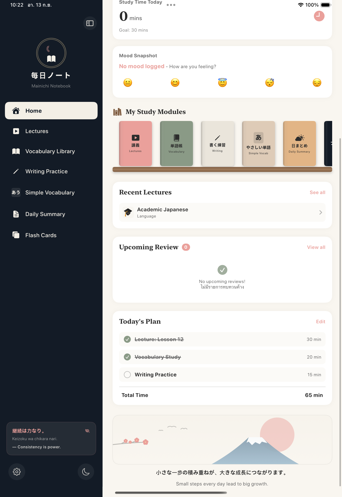
</p>

---

### 5. 📚 Vocabulary Library & Custom Word Creator
A comprehensive dictionary and personal lexical vault built for JLPT mastery.

* **528+ Curated Vocabulary Entries**: Pre-loaded vocabulary spanning JLPT levels (N5 to N1) and everyday thematic categories.
* **Rich Lexical Cards**: Displays Kanji, Hiragana reading, Romaji, Thai & English meanings, and part-of-speech tags (Noun, Verb, *i*-adjective, *na*-adjective).
* **Native Audio Pronunciation (TTS)**: Instant natural Japanese speech synthesis using Apple\'s `AVSpeechSynthesizer` with `ja-JP` vocalization.
* **Sliding Word Detail Drawer**: Inspect in-depth linguistic metadata, example sentences with contextual furigana, and quickly toggle flashcard enrollment or personal list bookmarks.
* **Custom Word Creator**: Full-featured form to input your own vocabulary terms, definitions, furigana readings, romaji, JLPT tiers, and custom example sentences.

<p align="center">
  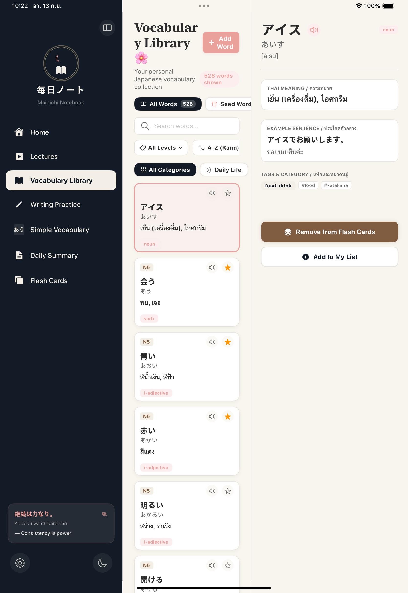
  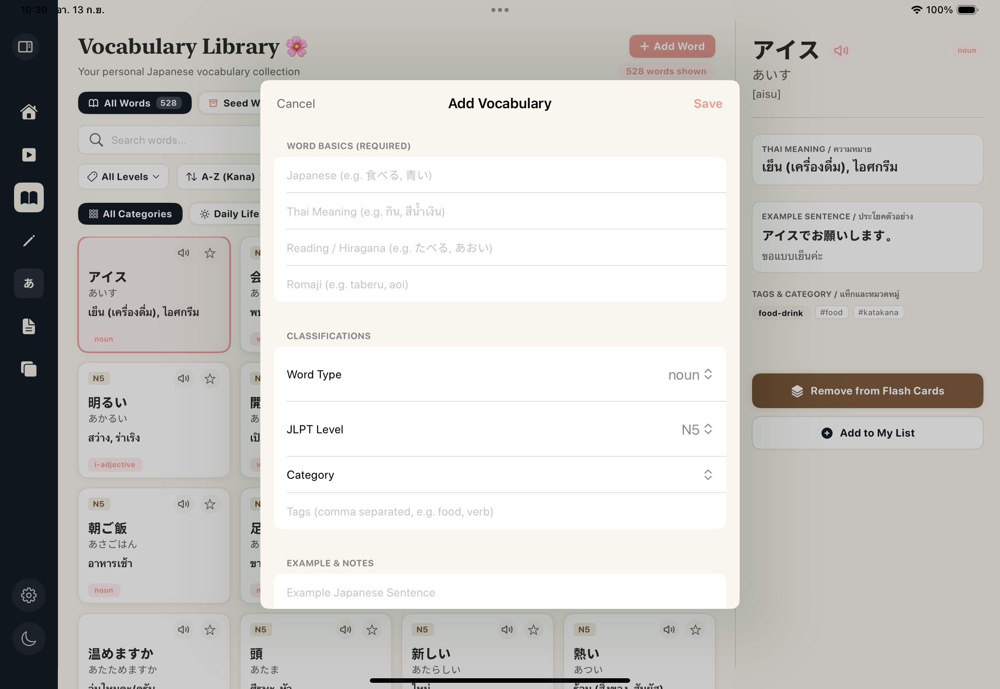
</p>

<p align="center">
  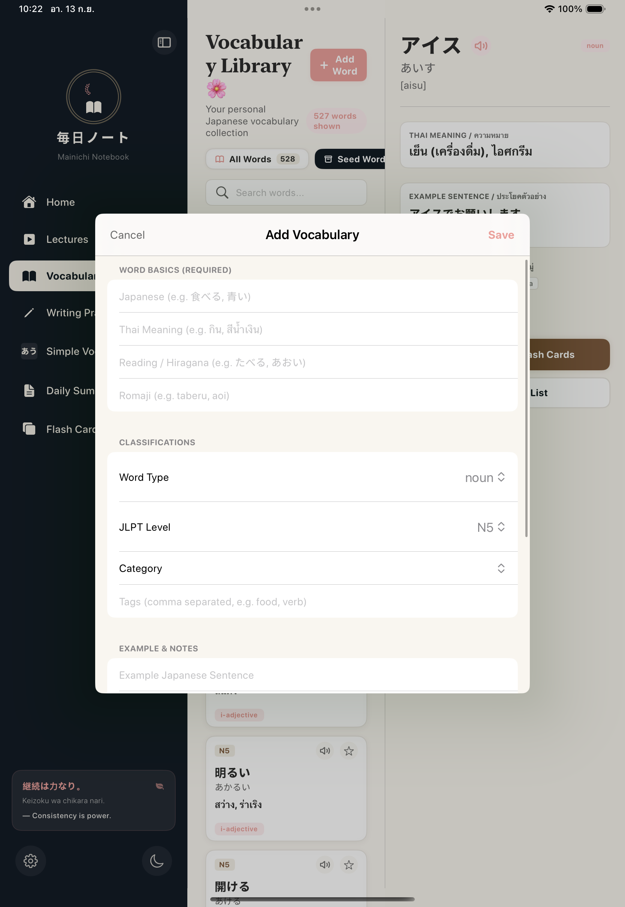
</p>

---

### 6. ✍️ Kana & Kanji Handwriting Practice
Build muscle memory through guided stroke order tracing.

* **50-Sound Gojūon Matrix**: Interactive grid covering all Hiragana and Katakana rows (*A, Ka, Sa, Ta, Na, Ha, Ma, Ya, Ra, Wa*).
* **Vector Stroke-Order Playback**: Step-by-step vector bezier curves demonstrating correct stroke sequences, directional paths, and numerical order.
* **Interactive Tracing Canvas**: Practice writing directly over guide outlines with active Apple Pencil stroke detection, accuracy validation, and clearing tools.
* **Audio Feedback & Guide Toggles**: Toggle auxiliary crosshair guides on or off and play native character pronunciations on demand.

<p align="center">
  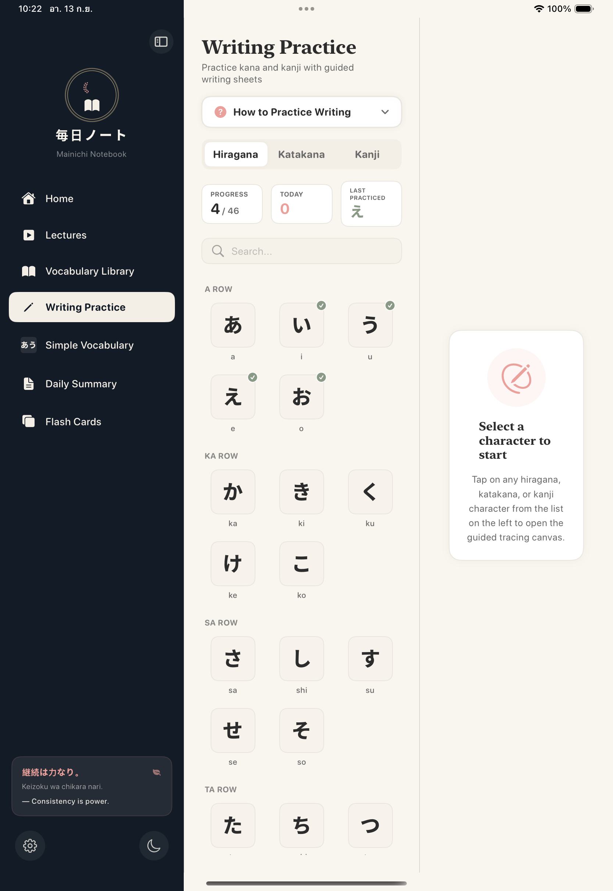
  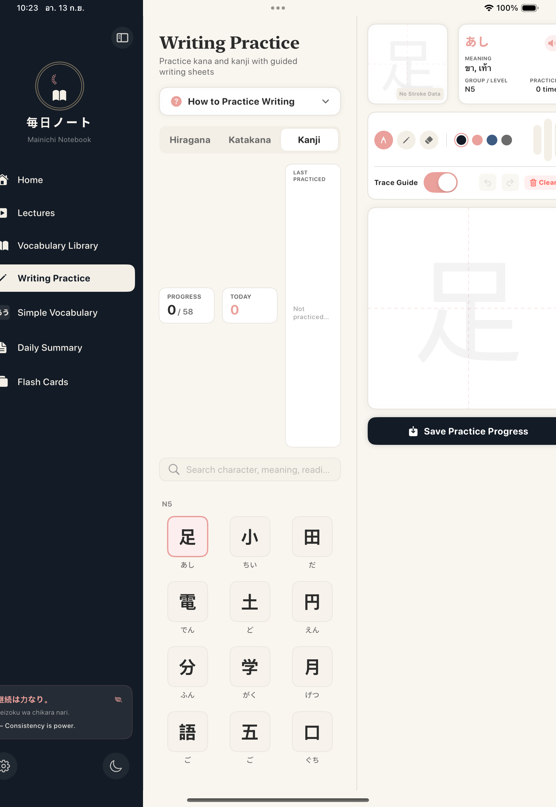
</p>

---

### 7. 🗂 Thematic Simple Vocabulary Packs
Curated micro-decks organized for bite-sized, contextual study sessions.

* **Starter Decks**: 500 Essential Words (JLPT N5 Beginner), Japanese Word Builder (Compound Nouns).
* **Situational Japanese**: Daily Life, Greetings & Everyday Conversation, Food & Dining, Shopping, and Classroom Survival.
* **Visual Progress Metrics**: Cards seen ratios, memorization percentages, and bookmark counts for every pack.

<p align="center">
  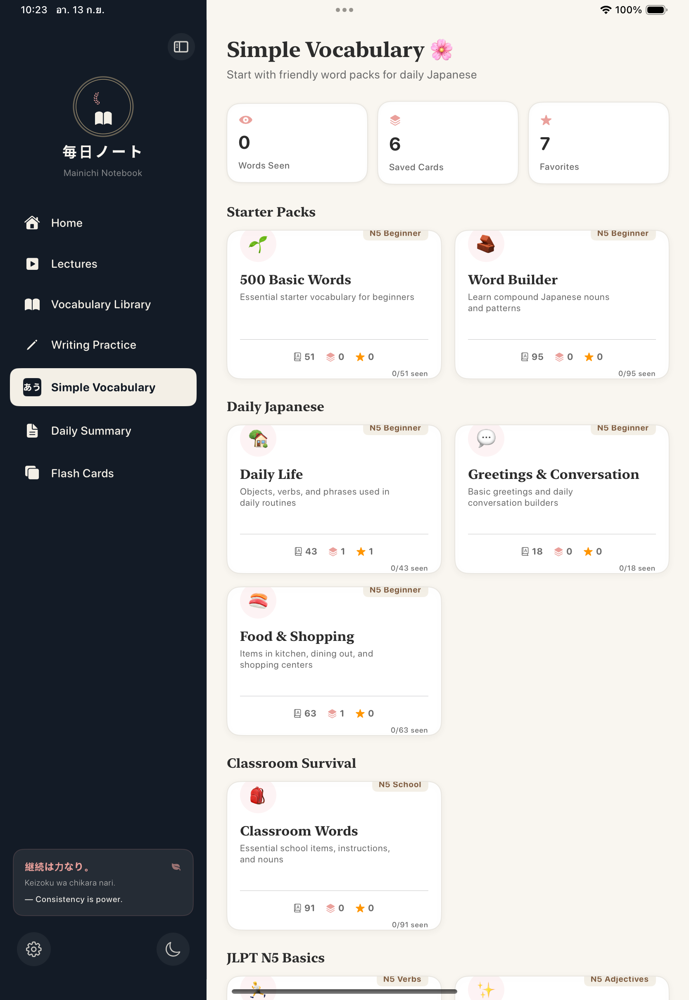
</p>

---

### 8. 📊 Daily Summary & Study Journal
Reflect on your daily progress and track long-term learning consistency.

* **6 KPI Performance Cards**: Total study minutes logged, cards reviewed, words starred, custom vocabulary added, kana characters traced, and thematic packs completed.
* **Quick Study Time Logger**: Single-tap time increment buttons (`+5 min`, `+10 min`, `+15 min`, `+30 min`) to quickly update your daily log.
* **Daily Goal Checklists**: Actionable checklist tracking completion of core daily habits (flashcard reviews, kana practice, daily journal entries).

<p align="center">
  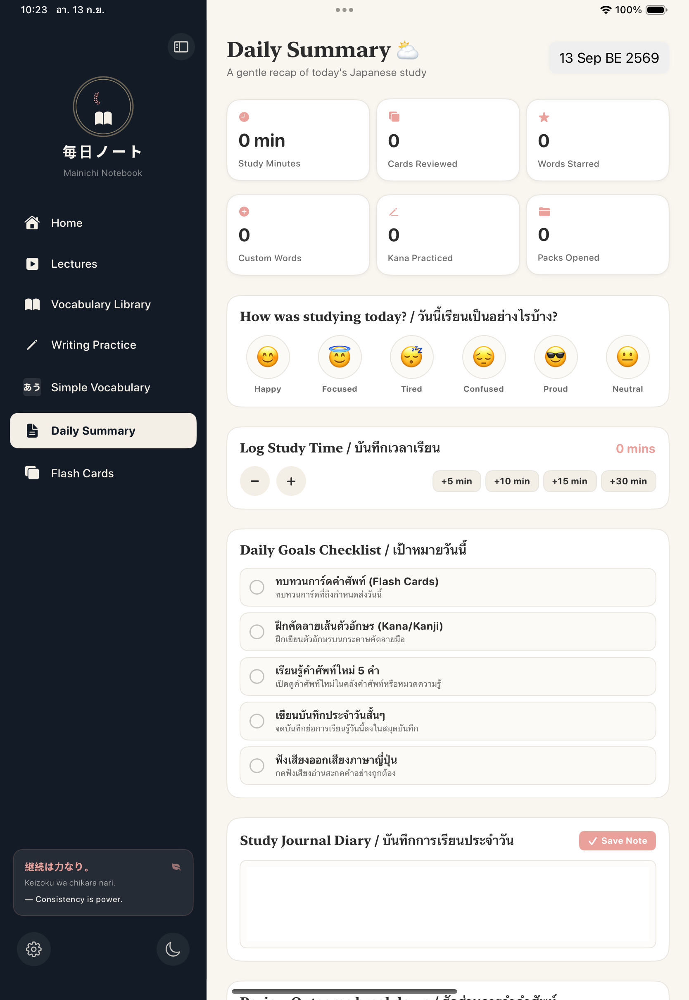
</p>

---

### 9. 🧠 Spaced Repetition System (SRS) & Flashcards
Scientifically optimized memorization powered by an implementation of the SuperMemo-2 (SM-2) algorithm.

* **Dynamic Review Queues**: Categorizes cards across `Due Today`, `New Words`, `Learning`, `Review`, and `Saved` states.
* **6 Versatile Quiz Modes**:
  1. **Preloaded Seed Prompts**: Hand-crafted high-yield examination questions.
  2. **Japanese ➔ Meaning**: Prompted with Kanji/Kana, identify the correct translation.
  3. **Meaning ➔ Japanese**: Prompted with meaning, select the corresponding Japanese term.
  4. **Reading (Kana) ➔ Meaning**: Test phonetic recognition without Kanji cues.
  5. **Meaning ➔ Reading (Kana)**: Test pronunciation and phonetic recall.
  6. **Mixed Dynamic Practice**: Randomized combination of all testing modes.
* **Adaptive Quiz Session**: Multiple-choice format with intelligent distractor algorithms, real-time answer validation, native audio vocalization, and dynamic card interval updates.
* **Customizable Presentation**: Toggle furigana visibility, romaji hints, example sentences, and shuffle settings.

<p align="center">
  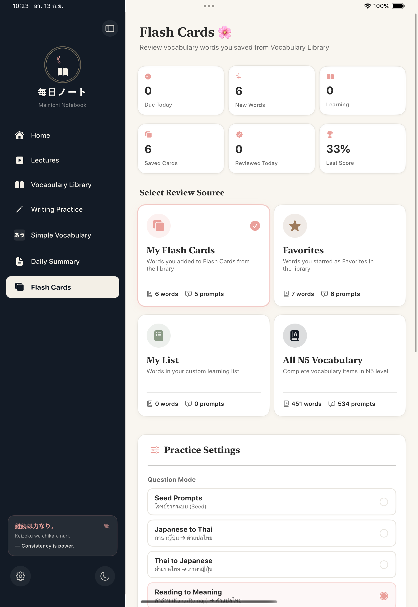
  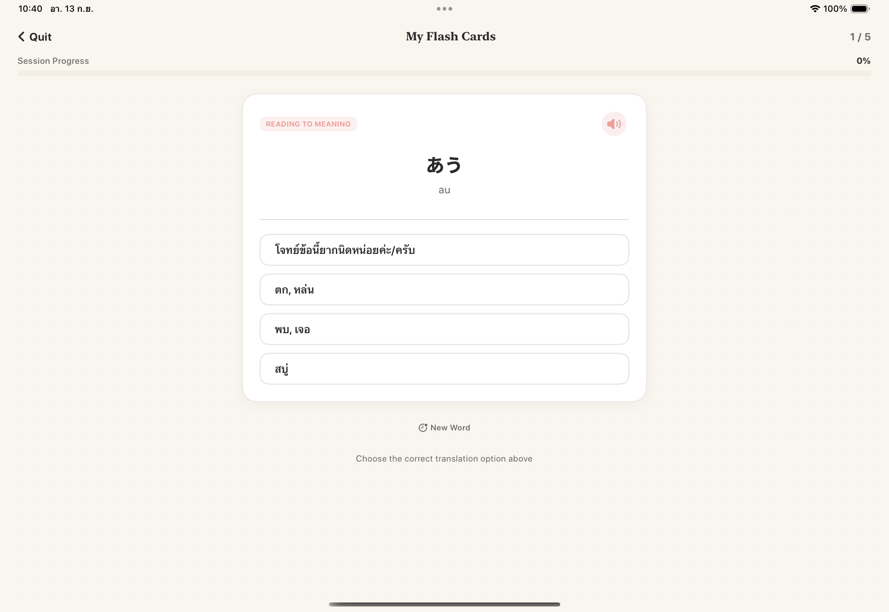
</p>

<p align="center">
  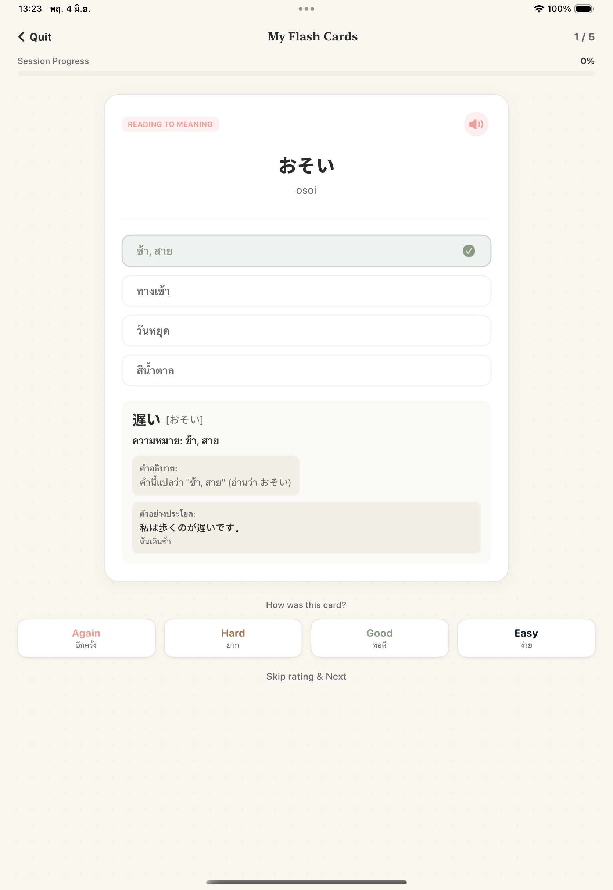
</p>

---

### 10. ⚙️ Settings, Customization & Dual Themes
Tailor the environment to your personal aesthetic and study habits.

* **Authentic Japanese Aesthetic**: Hand-crafted color palettes inspired by Japanese cherry blossoms (`AppTheme.sakuraPink`), matcha green (`AppTheme.sageGreen`), and warm washi paper (`AppTheme.paperBackground`).
* **Complete Native Dark Mode**: Full semantic color mapping ensuring high contrast and reduced eye strain during nighttime study sessions.
* **Audio & Haptic Feedback**: Toggle sound effects and tactile vibrations for button presses, page turns, and quiz results.
* **Local Study Reminders**: Schedule daily notifications to maintain study streaks without external push notification servers.

<p align="center">
  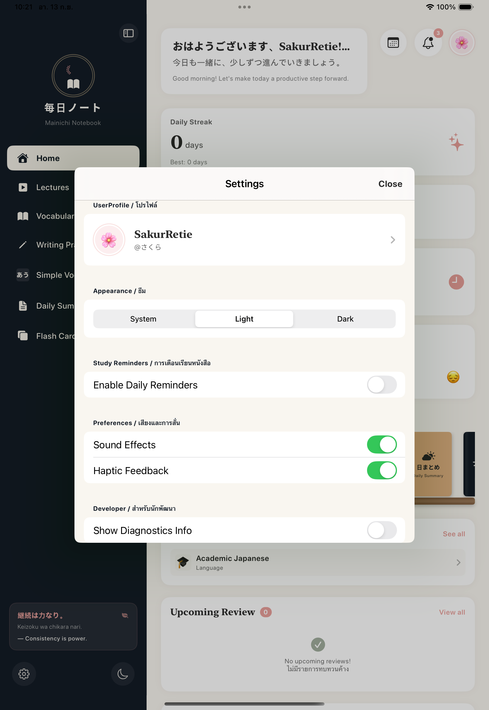
  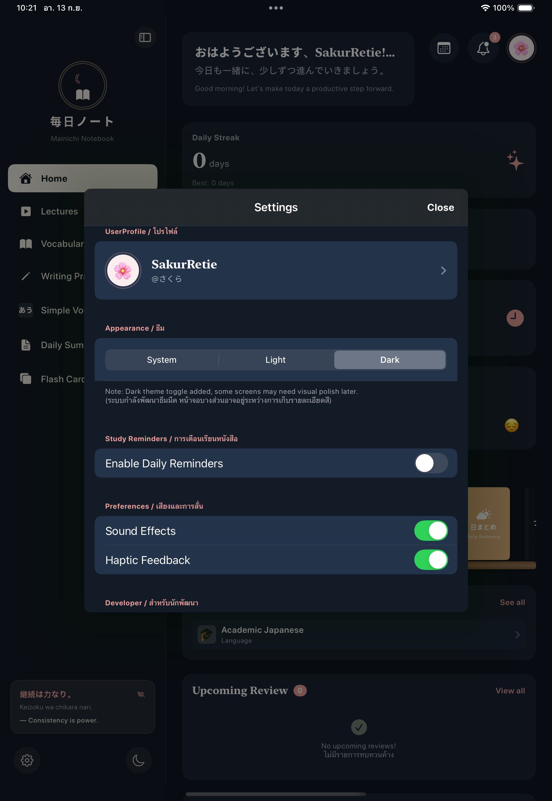
</p>

---

## 🏛 Technical Architecture & Engineering Highlights

```
MainichiNotebook/
├── App/
│   ├── MainichiNotebookApp.swift        # App Lifecycle & Environment Injection
│   └── ContentView.swift                # Root Navigation & Adaptive Layout SplitView
├── Theme/
│   ├── AppTheme.swift                   # Semantic Color Tokens, Typography, Dimensions
│   └── AppThemeMode.swift               # Light / Dark / System Appearance Switcher
├── Models/
│   ├── VocabularyItem.swift             # JLPT Word Definitions, Furigana & Readings
│   ├── FlashCardModels.swift            # SRS Card Entities & Prompt Structures
│   ├── LectureBook.swift                # Digital Notebook & Page Metadata
│   ├── PageAnnotation.swift             # Post-it, Sticker & Image Entities
│   └── StudyProgress.swift              # Streak, Time & Habit Records
├── Services/
│   ├── SRS/
│   │   ├── SRSScheduler.swift           # SM-2 Mathematical Algorithm Engine
│   │   └── SRSService.swift             # Review Queue Scheduling & Card State Persistence
│   ├── LectureStorage/
│   │   └── LectureStorageService.swift  # Drawing Stroke Serialization & JSON Book Vault
│   ├── PaperTemplates/
│   │   └── PaperTemplateRegistry.swift  # Vector Template Registry & Thumbnail Generators
│   ├── WritingPractice/
│   │   └── StrokePathRepository.swift   # Kana & Kanji Vector Coordinates & Guide Math
│   └── AppSettings/
│       ├── AppSettingsService.swift     # User Preferences & Theme State Manager
│       └── LocalNotificationService.swift # Local User Notification Center Dispatcher
├── Screens/
│   ├── HomeDashboardScreen.swift        # Home Hub & Progress View
│   ├── LecturesOverviewScreen.swift     # Bookshelf Shelf & Notebook Browser
│   ├── LectureBookEditorScreen.swift    # PencilKit Drawing Canvas & Tool Workspace
│   ├── VocabularyLibraryScreen.swift    # Filterable Dictionary & Detail Drawer
│   ├── WritingPracticeScreen.swift      # 50-Sound Kana Grid & Guided Tracing View
│   ├── SimpleVocabularyPacksScreen.swift # Thematic Word Packs Browser
│   ├── DailySummaryScreen.swift         # Daily Habit & Performance Metrics
│   ├── FlashCardsScreen.swift           # Flashcard Dashboard & Quiz Session Engine
│   └── Settings/
│       └── AppSettingsScreen.swift      # Profile, Appearance & Notification Settings
└── Components/
    ├── ZoomablePaperScrollView.swift    # UIKit UIScrollView + Gesture Recognizer Delegate
    ├── PencilCanvasView.swift           # PKCanvasView UIViewRepresentable Bridge
    ├── SidebarView.swift                # iPadOS Collapsible Sidebar Navigation
    └── PaperTemplates/                  # Vector Study Template Drawing Views
```

### Engineering Highlights

#### 1. UIKit-to-SwiftUI Gesture Coordination (`ZoomablePaperScrollView`)
* **Problem**: Standard SwiftUI gesture handling conflicts with `PKCanvasView` when attempting simultaneous multi-touch canvas panning/zooming while maintaining active Apple Pencil handwriting.
* **Solution**: Implemented a custom `UIViewRepresentable` bridging UIKit\'s `UIScrollView` with `UIGestureRecognizerDelegate`. By implementing `gestureRecognizer(_:shouldRecognizeSimultaneouslyWith:)`, multi-touch pan and pinch gestures operate harmoniously with Apple Pencil input with zero stroke drops.

#### 2. Spaced Repetition Mathematical Formulation (SM-2)
The scheduling engine implements a modified SM-2 algorithm:
$$\\text{EF}\' = \\text{EF} + (0.1 - (5 - q) \\times (0.08 + (5 - q) \\times 0.02))$$
$$\\text{Interval}(n) = \\begin{cases} 1 \\text{ day} & \\text{if } n = 1 \\\\ 6 \\text{ days} & \\text{if } n = 2 \\\\ \\text{Interval}(n - 1) \\times \\text{EF}\' & \\text{if } n > 2 \\end{cases}$$
* Where $q$ is the user\'s response grade ($0$ to $5$) and $\\text{EF}$ is the Ease Factor (initialized at $2.5$, clamped at a minimum of $1.3$). This ensures cards adapt dynamically to memory decay curves.

#### 3. Pure Vector Stroke Order Coordinates
* Kana and Kanji character paths are stored as normalized vector coordinate arrays ($0.0$ to $1.0$). 
* The engine dynamically maps and scales these coordinates using `UIBezierPath` transforms, ensuring crisp rendering across any display resolution from iPhone screens to 13-inch iPad Pro Liquid Retina displays.

#### 4. Swift 6 Concurrency & Strict Actor Isolation
* All view models (`@MainActor`) enforce strict thread safety across asynchronous file I/O and speech synthesis calls.
* Zero data races, zero concurrency warnings under Swift 6 strict checking mode.

#### 5. Zero Third-Party Dependencies & 100% Offline-First
* Eliminates supply chain vulnerabilities, dependency rot, and binary bloat.
* All data serialization utilizes native `JSONEncoder` / `JSONDecoder` with atomic file writes to the app\'s sandboxed `Documents/` directory.

---

## 💻 Prerequisites & Getting Started

### System Requirements
* **Development Machine**: macOS Sonoma (14.0) or macOS Sequoia (15.0+)
* **IDE**: Xcode 16.0 or later
* **Runtime Target**: iPadOS 16.0+ / iOS 16.0+ (Optimized for iPad Pro / iPad Air with Apple Pencil)
* **Language**: Swift 5.9 / Swift 6.0

### Installation Steps

1. **Clone the Repository**:
   ```bash
   git clone https://github.com/Propose34/MainichiNotebook.git
   cd MainichiNotebook
   ```

2. **Open the Project in Xcode**:
   ```bash
   open MainichiNotebook.xcodeproj
   ```

3. **Select the Build Target**:
   * In Xcode\'s target selector, choose **MainichiNotebook**.
   * Choose an iPad simulator (e.g., **iPad Pro 11-inch (M4)**) or connect a physical iPad device.

4. **Build & Run**:
   * Press **⌘ + R** (or click the **Play** button in Xcode).
   * The project compiles cleanly with **zero warnings** and launches immediately into the Home Dashboard.

---

## 🔒 Security & Privacy

* **Zero External Analytics**: No Firebase, no telemetry, no tracking SDKs.
* **Zero Network Calls**: Works completely in Airplane Mode with 100% feature availability.
* **Sandboxed Local Storage**: User notes, drawings, voice synthesis, and progress records remain strictly inside the local app sandbox.

---

## 📜 License

This project is open-sourced under the terms of the **MIT License**. See the [LICENSE](LICENSE) file for complete details.

---

<p align="center">
  Crafted with care for Japanese language learners worldwide. 🌸<br/>
  <b>Mainichi Notebook (毎日ノート)</b> — <i>Consistency is power (継続は力なり)</i>.
</p>


---

## 📑 Table of Contents
1. [Overview](#-overview)
2. [Key Features & Visual Tour](#-key-features--visual-tour)
   - [Lectures & Digital Notebook (Apple Pencil Canvas)](#1--lectures--digital-notebook-apple-pencil-canvas)
   - [Paper Template Library & Custom Imports](#2--paper-template-library--custom-imports)
   - [Interactive Annotations, Stickers & PDF Annotation](#3--interactive-annotations-stickers--pdf-annotation)
   - [Home Dashboard & Daily Study Planner](#4--home-dashboard--daily-study-planner)
   - [Vocabulary Library & Custom Word Creator](#5--vocabulary-library--custom-word-creator)
   - [Kana & Kanji Handwriting Practice](#6--kana--kanji-handwriting-practice)
   - [Thematic Simple Vocabulary Packs](#7--thematic-simple-vocabulary-packs)
   - [Daily Summary & Study Journal](#8--daily-summary--study-journal)
   - [Spaced Repetition System (SRS) & Flashcards](#9--spaced-repetition-system-srs--flashcards)
   - [Settings, Customization & Dual Themes](#10--settings-customization--dual-themes)
3. [Technical Architecture & Engineering Highlights](#-technical-architecture--engineering-highlights)
4. [Project Structure](#-project-structure)
5. [Prerequisites & Getting Started](#-prerequisites--getting-started)
6. [Security & Privacy](#-security--privacy)
7. [License](#-license)

---

## 📖 Overview

**Mainichi Notebook (毎日ノート)** is a specialized, native iPadOS and iOS productivity application engineered specifically for Japanese language learners. It seamlessly merges the tactile retention benefits of digital handwriting via **Apple Pencil & PencilKit** with the cognitive efficiency of algorithmic **Spaced Repetition System (SRS)** flashcard review.

Instead of fragmenting the study workflow across separate flashcard apps, PDF readers, and generic note-taking tools, **Mainichi Notebook** unifies them into a cohesive Japanese study environment. Designed around a warm wabi-sabi paper aesthetic, it provides dedicated vector study sheets (such as *Genkouyoushi* manuscript paper and *Cornell Notes*), real-time stroke order kana tracing, audio pronunciation, and multi-mode vocabulary testing.

### Core Principles
- **Tactile Learning First**: Fine-tuned PencilKit canvas with sub-millisecond stroke response and simultaneous pinch-to-zoom multi-touch handling.
- **Cognitive Retention**: Proprietary SuperMemo-2 (SM-2) Spaced Repetition scheduling engine with dynamic intervals and ease factor recalculation.
- **100% Offline & Private**: Zero external network calls, zero telemetry, and zero third-party dependencies. All user notebooks, audio files, and progress data are stored securely on the local device filesystem.
- **Pure Native Swift & SwiftUI**: Crafted using modern Swift 6 concurrency, UIKit interoperability, and Apple native design guidelines.

---

## ✨ Key Features & Visual Tour

### 1. 📝 Lectures & Digital Notebook (Apple Pencil Canvas)
The heart of Mainichi Notebook is an interactive digital notebook workstation engineered for handwritten lecture notes, exercises, and linguistic diagrams.

* **Wooden Bookshelf Display**: Notebooks are organized on a wooden bookshelf interface with customizable color covers, Japanese and English titles, subject badges (*Language, Culture, Science, Humanities*), and page counters.
* **Low-Latency PencilKit Engine**: Supports smooth calligraphy and standard writing tools including Study Pen, Fountain Pen, Calligraphy Brush, Pencil, Highlighter, and Vector Eraser.
* **Concurrent Gesture Workspace**: Integrated via a custom UIKit `CenteringUIScrollView` and `UIGestureRecognizerDelegate`, enabling smooth multi-touch pinch-to-zoom and canvas panning without stroke interruptions or tool contention.
* **Page Management & Thumbnail Drawer**: Reorder, add, or delete pages on the fly with a collapsible left thumbnail navigation drawer.

<p align="center">
  
  
</p>

---

### 2. 📑 Paper Template Library & Custom Imports
Take notes on specialized Japanese study paper instead of blank screens.

* **8 Built-in Vector Study Templates**:
  * **Genkouyoushi (原稿用紙)**: Traditional Japanese manuscript paper with centered grid crosses for kanji composition.
  * **Cornell Notes**: Dedicated cue columns, note-taking canvas, and bottom summary blocks.
  * **Kana & Kanji Grids**: 4-quadrant character practice blocks with stroke alignment guides.
  * **Grammar Patterns**: Pre-formatted syntax connection and conjugation tables.
  * **Standard Paper**: Ruled, Classic Grid, Dot Grid, and Clean Blank paper.
* **Template Selector**: Bookmark favorite paper types, apply templates to the current page, or create new pages pre-loaded with specific templates.
* **Custom Paper & Document Importer**: Import your own custom paper backgrounds or high-resolution graphic grids directly from device storage.

<p align="center">
  
</p>

---

### 3. 🎨 Interactive Annotations, Stickers & PDF Annotation
Enrich your study notes with interactive digital elements.

* **Japanese Cultural Stickers**: Decorate notebooks with themed sticker stamps (🌸 Sakura, ⛩️ Torii Gate, 🗻 Mount Fuji, 🏮 Chōchin Lantern, 🦊 Kitsune, 🍵 Matcha, 🍣 Sushi, and study achievement marks).
* **Movable Post-it Sticky Notes**: Add typed notes and reminders that can be resized, dragged, and positioned anywhere on the canvas.
* **Photo Library Integration**: Insert reference diagrams, textbook pictures, and grammar infographics directly onto notebook pages.
* **PDF Handout Annotation**: Import multi-page lecture slides and PDF documents to write, highlight, and take notes directly on top of slides.
* **High-Res Page Flattening**: Render and export pages combining background templates, Apple Pencil handwriting, and multimedia annotations into crisp, high-resolution images via the native iOS Share Sheet.

<p align="center">
  
</p>

---

### 4. 🏠 Home Dashboard & Daily Study Planner
A centralized command center designed to keep learners focused, motivated, and consistent.

* **Bilingual Japanese Greeting**: Time-aware greeting widget with English translation (e.g., `おはようございます、SakurRetie! 🌸`).
* **Daily Streak Tracker**: Automatically calculates consecutive active study days and preserves your all-time best streak.
* **Progress Ring (4 Core Metrics)**: Circular visual progress indicator tracking daily completion across Lectures, Vocabulary, Handwriting, and SRS Reviews.
* **Study Time Goal**: Configurable daily target timer (e.g., 30 minutes) measuring total logged study time.
* **Mood Logger**: 5-point emotional status logger (Happy, Blessed, Neutral, Sleepy, Sad) to correlate mood with retention.
* **Today\'s Plan (Interactive Checklist)**: Customizable checklist with estimated task durations and total calculated study minutes.
* **Japanese Proverb of the Day**: Curated wisdom widget featuring kanji, furigana readings, and English translations (e.g., `継続は力なり - Consistency is power`).

<p align="center">
  
  
</p>

---

### 5. 📚 Vocabulary Library & Custom Word Creator
A comprehensive dictionary and personal lexical vault built for JLPT mastery.

* **528+ Curated Vocabulary Entries**: Pre-loaded vocabulary spanning JLPT levels (N5 to N1) and everyday thematic categories.
* **Rich Lexical Cards**: Displays Kanji, Hiragana reading, Romaji, Thai & English meanings, and part-of-speech tags (Noun, Verb, *i*-adjective, *na*-adjective).
* **Native Audio Pronunciation (TTS)**: Instant natural Japanese speech synthesis using Apple\'s `AVSpeechSynthesizer` with `ja-JP` vocalization.
* **Sliding Word Detail Drawer**: Inspect in-depth linguistic metadata, example sentences with contextual furigana, and quickly toggle flashcard enrollment or personal list bookmarks.
* **Custom Word Creator**: Full-featured form to input your own vocabulary terms, definitions, furigana readings, romaji, JLPT tiers, and custom example sentences.

<p align="center">
  
  
</p>

<p align="center">
  
</p>

---

### 6. ✍️ Kana & Kanji Handwriting Practice
Build muscle memory through guided stroke order tracing.

* **50-Sound Gojūon Matrix**: Interactive grid covering all Hiragana and Katakana rows (*A, Ka, Sa, Ta, Na, Ha, Ma, Ya, Ra, Wa*).
* **Vector Stroke-Order Playback**: Step-by-step vector bezier curves demonstrating correct stroke sequences, directional paths, and numerical order.
* **Interactive Tracing Canvas**: Practice writing directly over guide outlines with active Apple Pencil stroke detection, accuracy validation, and clearing tools.
* **Audio Feedback & Guide Toggles**: Toggle auxiliary crosshair guides on or off and play native character pronunciations on demand.

<p align="center">
  
  
</p>

---

### 7. 🗂 Thematic Simple Vocabulary Packs
Curated micro-decks organized for bite-sized, contextual study sessions.

* **Starter Decks**: 500 Essential Words (JLPT N5 Beginner), Japanese Word Builder (Compound Nouns).
* **Situational Japanese**: Daily Life, Greetings & Everyday Conversation, Food & Dining, Shopping, and Classroom Survival.
* **Visual Progress Metrics**: Cards seen ratios, memorization percentages, and bookmark counts for every pack.

<p align="center">
  
</p>

---

### 8. 📊 Daily Summary & Study Journal
Reflect on your daily progress and track long-term learning consistency.

* **6 KPI Performance Cards**: Total study minutes logged, cards reviewed, words starred, custom vocabulary added, kana characters traced, and thematic packs completed.
* **Quick Study Time Logger**: Single-tap time increment buttons (`+5 min`, `+10 min`, `+15 min`, `+30 min`) to quickly update your daily log.
* **Daily Goal Checklists**: Actionable checklist tracking completion of core daily habits (flashcard reviews, kana practice, daily journal entries).

<p align="center">
  
</p>

---

### 9. 🧠 Spaced Repetition System (SRS) & Flashcards
Scientifically optimized memorization powered by an implementation of the SuperMemo-2 (SM-2) algorithm.

* **Dynamic Review Queues**: Categorizes cards across `Due Today`, `New Words`, `Learning`, `Review`, and `Saved` states.
* **6 Versatile Quiz Modes**:
  1. **Preloaded Seed Prompts**: Hand-crafted high-yield examination questions.
  2. **Japanese ➔ Meaning**: Prompted with Kanji/Kana, identify the correct translation.
  3. **Meaning ➔ Japanese**: Prompted with meaning, select the corresponding Japanese term.
  4. **Reading (Kana) ➔ Meaning**: Test phonetic recognition without Kanji cues.
  5. **Meaning ➔ Reading (Kana)**: Test pronunciation and phonetic recall.
  6. **Mixed Dynamic Practice**: Randomized combination of all testing modes.
* **Adaptive Quiz Session**: Multiple-choice format with intelligent distractor algorithms, real-time answer validation, native audio vocalization, and dynamic card interval updates.
* **Customizable Presentation**: Toggle furigana visibility, romaji hints, example sentences, and shuffle settings.

<p align="center">
  
  
</p>

<p align="center">
  
</p>

---

### 10. ⚙️ Settings, Customization & Dual Themes
Tailor the environment to your personal aesthetic and study habits.

* **Authentic Japanese Aesthetic**: Hand-crafted color palettes inspired by Japanese cherry blossoms (`AppTheme.sakuraPink`), matcha green (`AppTheme.sageGreen`), and warm washi paper (`AppTheme.paperBackground`).
* **Complete Native Dark Mode**: Full semantic color mapping ensuring high contrast and reduced eye strain during nighttime study sessions.
* **Audio & Haptic Feedback**: Toggle sound effects and tactile vibrations for button presses, page turns, and quiz results.
* **Local Study Reminders**: Schedule daily notifications to maintain study streaks without external push notification servers.

<p align="center">
  
  
</p>

---

## 🏛 Technical Architecture & Engineering Highlights

```
MainichiNotebook/
├── App/
│   ├── MainichiNotebookApp.swift        # App Lifecycle & Environment Injection
│   └── ContentView.swift                # Root Navigation & Adaptive Layout SplitView
├── Theme/
│   ├── AppTheme.swift                   # Semantic Color Tokens, Typography, Dimensions
│   └── AppThemeMode.swift               # Light / Dark / System Appearance Switcher
├── Models/
│   ├── VocabularyItem.swift             # JLPT Word Definitions, Furigana & Readings
│   ├── FlashCardModels.swift            # SRS Card Entities & Prompt Structures
│   ├── LectureBook.swift                # Digital Notebook & Page Metadata
│   ├── PageAnnotation.swift             # Post-it, Sticker & Image Entities
│   └── StudyProgress.swift              # Streak, Time & Habit Records
├── Services/
│   ├── SRS/
│   │   ├── SRSScheduler.swift           # SM-2 Mathematical Algorithm Engine
│   │   └── SRSService.swift             # Review Queue Scheduling & Card State Persistence
│   ├── LectureStorage/
│   │   └── LectureStorageService.swift  # Drawing Stroke Serialization & JSON Book Vault
│   ├── PaperTemplates/
│   │   └── PaperTemplateRegistry.swift  # Vector Template Registry & Thumbnail Generators
│   ├── WritingPractice/
│   │   └── StrokePathRepository.swift   # Kana & Kanji Vector Coordinates & Guide Math
│   └── AppSettings/
│       ├── AppSettingsService.swift     # User Preferences & Theme State Manager
│       └── LocalNotificationService.swift # Local User Notification Center Dispatcher
├── Screens/
│   ├── HomeDashboardScreen.swift        # Home Hub & Progress View
│   ├── LecturesOverviewScreen.swift     # Bookshelf Shelf & Notebook Browser
│   ├── LectureBookEditorScreen.swift    # PencilKit Drawing Canvas & Tool Workspace
│   ├── VocabularyLibraryScreen.swift    # Filterable Dictionary & Detail Drawer
│   ├── WritingPracticeScreen.swift      # 50-Sound Kana Grid & Guided Tracing View
│   ├── SimpleVocabularyPacksScreen.swift # Thematic Word Packs Browser
│   ├── DailySummaryScreen.swift         # Daily Habit & Performance Metrics
│   ├── FlashCardsScreen.swift           # Flashcard Dashboard & Quiz Session Engine
│   └── Settings/
│       └── AppSettingsScreen.swift      # Profile, Appearance & Notification Settings
└── Components/
    ├── ZoomablePaperScrollView.swift    # UIKit UIScrollView + Gesture Recognizer Delegate
    ├── PencilCanvasView.swift           # PKCanvasView UIViewRepresentable Bridge
    ├── SidebarView.swift                # iPadOS Collapsible Sidebar Navigation
    └── PaperTemplates/                  # Vector Study Template Drawing Views
```

### Engineering Highlights

#### 1. UIKit-to-SwiftUI Gesture Coordination (`ZoomablePaperScrollView`)
* **Problem**: Standard SwiftUI gesture handling conflicts with `PKCanvasView` when attempting simultaneous multi-touch canvas panning/zooming while maintaining active Apple Pencil handwriting.
* **Solution**: Implemented a custom `UIViewRepresentable` bridging UIKit\'s `UIScrollView` with `UIGestureRecognizerDelegate`. By implementing `gestureRecognizer(_:shouldRecognizeSimultaneouslyWith:)`, multi-touch pan and pinch gestures operate harmoniously with Apple Pencil input with zero stroke drops.

#### 2. Spaced Repetition Mathematical Formulation (SM-2)
The scheduling engine implements a modified SM-2 algorithm:
$$\\text{EF}\' = \\text{EF} + (0.1 - (5 - q) \\times (0.08 + (5 - q) \\times 0.02))$$
$$\\text{Interval}(n) = \\begin{cases} 1 \\text{ day} & \\text{if } n = 1 \\\\ 6 \\text{ days} & \\text{if } n = 2 \\\\ \\text{Interval}(n - 1) \\times \\text{EF}\' & \\text{if } n > 2 \\end{cases}$$
* Where $q$ is the user\'s response grade ($0$ to $5$) and $\\text{EF}$ is the Ease Factor (initialized at $2.5$, clamped at a minimum of $1.3$). This ensures cards adapt dynamically to memory decay curves.

#### 3. Pure Vector Stroke Order Coordinates
* Kana and Kanji character paths are stored as normalized vector coordinate arrays ($0.0$ to $1.0$). 
* The engine dynamically maps and scales these coordinates using `UIBezierPath` transforms, ensuring crisp rendering across any display resolution from iPhone screens to 13-inch iPad Pro Liquid Retina displays.

#### 4. Swift 6 Concurrency & Strict Actor Isolation
* All view models (`@MainActor`) enforce strict thread safety across asynchronous file I/O and speech synthesis calls.
* Zero data races, zero concurrency warnings under Swift 6 strict checking mode.

#### 5. Zero Third-Party Dependencies & 100% Offline-First
* Eliminates supply chain vulnerabilities, dependency rot, and binary bloat.
* All data serialization utilizes native `JSONEncoder` / `JSONDecoder` with atomic file writes to the app\'s sandboxed `Documents/` directory.

---

## 💻 Prerequisites & Getting Started

### System Requirements
* **Development Machine**: macOS Sonoma (14.0) or macOS Sequoia (15.0+)
* **IDE**: Xcode 16.0 or later
* **Runtime Target**: iPadOS 16.0+ / iOS 16.0+ (Optimized for iPad Pro / iPad Air with Apple Pencil)
* **Language**: Swift 5.9 / Swift 6.0

### Installation Steps

1. **Clone the Repository**:
   ```bash
   git clone https://github.com/Propose34/MainichiNotebook.git
   cd MainichiNotebook
   ```

2. **Open the Project in Xcode**:
   ```bash
   open MainichiNotebook.xcodeproj
   ```

3. **Select the Build Target**:
   * In Xcode\'s target selector, choose **MainichiNotebook**.
   * Choose an iPad simulator (e.g., **iPad Pro 11-inch (M4)**) or connect a physical iPad device.

4. **Build & Run**:
   * Press **⌘ + R** (or click the **Play** button in Xcode).
   * The project compiles cleanly with **zero warnings** and launches immediately into the Home Dashboard.

---

## 🔒 Security & Privacy

* **Zero External Analytics**: No Firebase, no telemetry, no tracking SDKs.
* **Zero Network Calls**: Works completely in Airplane Mode with 100% feature availability.
* **Sandboxed Local Storage**: User notes, drawings, voice synthesis, and progress records remain strictly inside the local app sandbox.

---

## 📜 License

This project is open-sourced under the terms of the **MIT License**. See the [LICENSE](LICENSE) file for complete details.

---

<p align="center">
  Crafted with care for Japanese language learners worldwide. 🌸<br/>
  <b>Mainichi Notebook (毎日ノート)</b> — <i>Consistency is power (継続は力なり)</i>.
</p>
